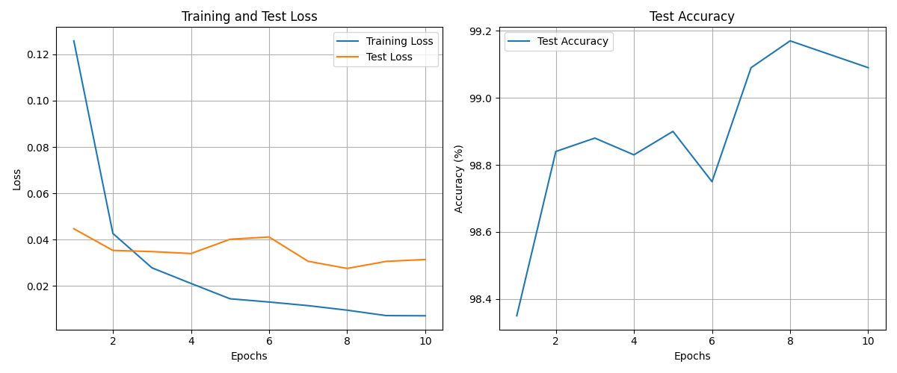
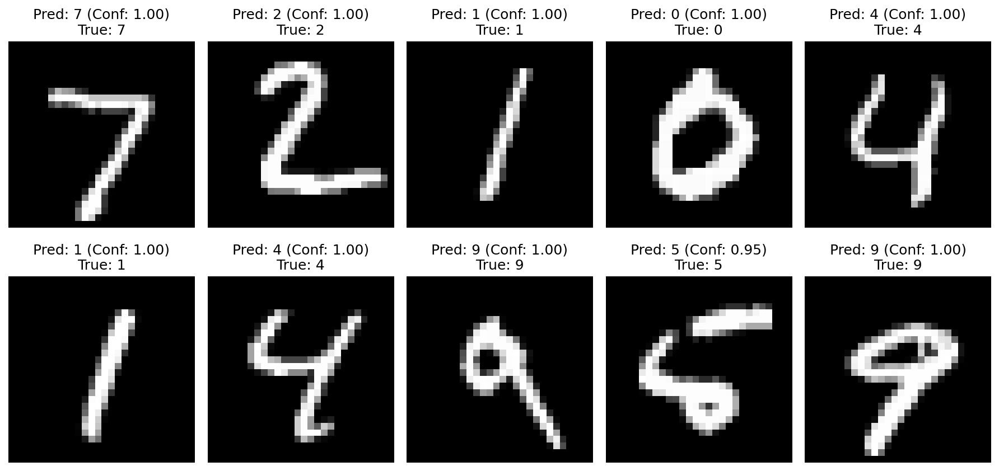

# MNIST Digit Recognition with CNN

A deep learning project for handwritten digit recognition using Convolutional Neural Networks (CNN) on the MNIST dataset.

## 📋 项目介绍

本项目实现了一个基于卷积神经网络的手写数字识别系统，使用PyTorch框架在MNIST数据集上进行训练。项目包含完整的训练流程、模型评估和可视化功能。

### 主要特性

- 🧠 **CNN架构**: 使用2层卷积层 + 2层全连接层的经典CNN结构
- 📊 **自动可视化**: 训练过程中自动生成损失和准确率曲线图
- 💾 **模型保存**: 自动保存最佳模型和最终模型
- 🔄 **GPU支持**: 自动检测并使用GPU加速训练（如果可用）
- 📈 **实时监控**: 训练过程中实时显示损失和准确率
- 🎯 **演示功能**: 提供模型预测演示和可视化

### 模型架构

```
CNN(
  (conv1): Conv2d(1, 32, kernel_size=(3, 3), stride=(1, 1), padding=(1, 1))
  (conv2): Conv2d(32, 64, kernel_size=(3, 3), stride=(1, 1), padding=(1, 1))
  (pool): MaxPool2d(kernel_size=2, stride=2, padding=0, dilation=1, ceil_mode=False)
  (fc1): Linear(in_features=3136, out_features=128, bias=True)
  (fc2): Linear(in_features=128, out_features=10, bias=True)
)
```

## 🚀 快速开始

### 环境要求

- Python 3.7+
- PyTorch
- torchvision
- matplotlib
- numpy

### 安装依赖

```bash
pip install -r requirements.txt
```

### 数据集下载

项目会自动下载MNIST数据集，无需手动下载。数据集将保存在 `./data` 目录下：

```
data/
└── MNIST/
    └── raw/
        ├── train-images-idx3-ubyte
        ├── train-labels-idx1-ubyte
        ├── t10k-images-idx3-ubyte
        └── t10k-labels-idx1-ubyte
```

### 运行训练

```bash
python main.py
```

训练过程将：
1. 自动下载MNIST数据集（如果不存在）
2. 训练CNN模型10个epoch
3. 保存最佳模型和最终模型到 `output/` 目录
4. 生成训练指标可视化图表

### 模型演示

训练完成后，可以运行演示脚本来测试模型：

```bash
python demo.py
```

演示脚本将：
1. 加载训练好的最佳模型
2. 在测试集上验证模型准确率
3. 生成预测可视化图表
4. 展示随机样本的预测结果

## 📊 训练结果

### 最佳性能
- **最佳测试准确率**: 99.17%
- **训练轮数**: 10 epochs
- **批次大小**: 64
- **学习率**: 0.001

### 训练过程

| Epoch | Training Loss | Test Loss | Test Accuracy |
|-------|---------------|-----------|---------------|
| 1     | -            | 0.0447    | 98.35%        |
| 2     | -            | 0.0353    | 98.84%        |
| 3     | -            | 0.0348    | 98.88%        |
| 4     | -            | 0.0340    | 98.83%        |
| 5     | -            | 0.0401    | 98.90%        |
| 6     | -            | 0.0411    | 98.75%        |
| 7     | -            | 0.0306    | 99.09%        |
| 8     | -            | 0.0275    | **99.17%**    |
| 9     | -            | 0.0306    | 99.13%        |
| 10    | -            | 0.0314    | 99.09%        |

### 输出文件

训练完成后，`output/` 目录将包含：

- `mnist_cnn_best_acc_99.17.pth` - 最佳准确率模型权重
- `mnist_cnn_final.pth` - 最终模型权重
- `training_metrics.png` - 训练指标可视化图表
- `prediction_demo.png` - 预测演示图表（运行demo.py后生成）
- `output.log` - 详细训练日志
- `mnist_sample.png` - MNIST样本图片

## 🎯 模型性能分析

### 训练曲线


从训练曲线可以看出：
- 模型在第8个epoch达到最佳性能（99.17%准确率）
- 训练损失和测试损失都呈现下降趋势
- 模型收敛良好，没有明显的过拟合现象

### 预测演示


### 模型优势
1. **高准确率**: 在MNIST测试集上达到99.17%的准确率
2. **快速收敛**: 仅需8个epoch即可达到最佳性能
3. **稳定训练**: 训练过程稳定，损失函数平滑下降
4. **实用性强**: 提供完整的训练和演示流程

## 🔧 自定义配置

你可以通过修改 `main.py` 中的超参数来调整训练：

```python
# 超参数配置
BATCH_SIZE = 64      # 批次大小
EPOCHS = 10          # 训练轮数
LEARNING_RATE = 0.001  # 学习率
```

## 📁 项目结构

```
MNIST-Digit-Recognition-CNN/
├── main.py              # 主训练脚本
├── demo.py              # 模型演示脚本
├── requirements.txt     # 依赖包列表
├── README.md           # 项目说明文档
├── .gitignore          # Git忽略文件
├── data/               # 数据集目录（自动创建）
│   └── MNIST/
└── output/             # 输出文件目录
    ├── mnist_cnn_best_acc_99.17.pth
    ├── mnist_cnn_final.pth
    ├── training_metrics.png
    ├── prediction_demo.png
    ├── output.log
    └── .gitkeep
```

## 🤝 贡献

欢迎提交Issue和Pull Request来改进这个项目！

## 📄 许可证

本项目采用MIT许可证。

## 🙏 致谢

- MNIST数据集提供者
- PyTorch开发团队
- 深度学习社区

---

**注意**: 首次运行时会自动下载MNIST数据集（约11MB），请确保网络连接正常。 